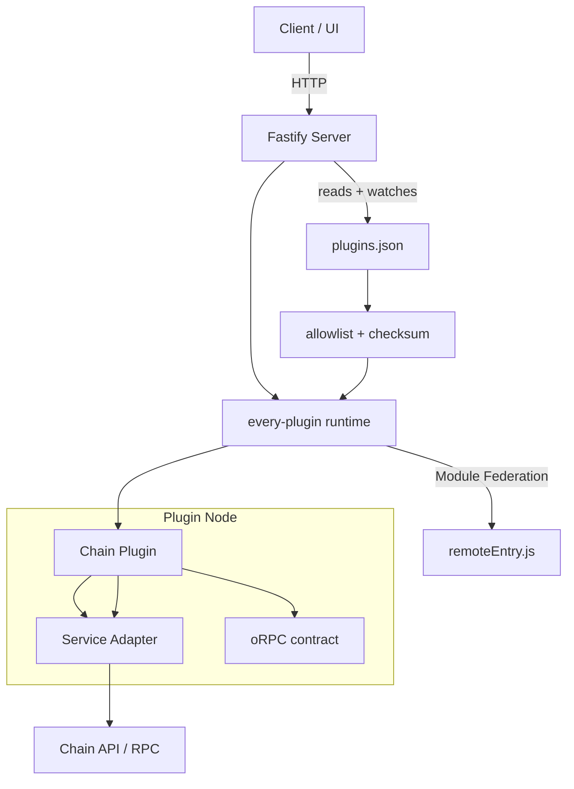

# TxPlug (Every‑Plugin Runtime)

TxPlug is a plugin‑first wallet transaction aggregator. The server loads chain plugins from plugins.json and exposes a single HTTP surface for transactions, chain info, and CSV export. Plugins can be deployed independently, so adding a new chain doesn’t require a server redeploy.

## What this is

- A runtime host for chain plugins (EVM, Solana, Polkadot/Moonbeam, Bitcoin, UTXO, Cardano, NEAR, Aptos, Sui, Tezos, Tron, Bittensor).
- A single API for transactions, chain metadata, and CSV export.
- A hot‑reloadable registry (plugins.json) so new plugins can be added without restarting the server.

## How it works

- Each plugin implements the same oRPC contract (getTransactions, getChainInfo).
- The server watches plugins.json and reloads the runtime when it changes.
- Plugins load from remoteEntry URLs (Module Federation), which lets them be deployed on their own.

## Architecture

## Project layout

- plugins/: Chain plugins (each follows the every‑plugin structure).
- server/: Fastify runtime host that mounts plugin clients and exposes routes.
- plugins.json: Registry of plugins, remotes, and config.

## API overview

- GET /health
- GET /api/chains
- GET /api/:chain/transactions/:address?limit=100&offset=0
- GET /api/:chain/info
- GET /api/:chain/export/:address (Awakens CSV format)

## Configuration

plugins.json controls which plugins are enabled and how they’re configured.

Common fields:
- enabled: boolean
- remote: URL to the plugin remoteEntry.js
- secrets: provider-specific API keys
- variables: chain/provider settings

Local dev uses the port defined in each plugin’s plugin.dev.ts.

Security controls:
- allowlist: list of approved remote hosts (host:port) in plugins.json
- requireChecksum: when true, plugins must provide a sha256 checksum
- checksum: sha256 of remoteEntry.js content

## Development

1. Start any plugin dev servers you want to use.
2. Start the server.
3. Edit plugins.json to enable/disable plugins or update configuration.

The server will reload automatically when plugins.json changes.

## Production workflow (template‑first)

Use the template so contributors don’t need direct access to this repo:

1. Clone the template in templates/plugin-template
2. Implement the provider logic and build it
3. Deploy the build anywhere (e.g., Zephyr) to get a remoteEntry.js URL
4. Update plugins.json with that remote URL, secrets, and variables

This keeps the core server stable and lets third parties own their plugin lifecycle.

## Extending the project

To add a new chain:
1. Create a new plugin under plugins/ following the standard structure:
   - src/contract.ts
   - src/service.ts
   - src/index.ts
   - rspack.config.cjs
   - plugin.dev.ts
2. Expose getTransactions and getChainInfo in the contract.
3. Implement a service that calls the target chain API.
4. Build and serve the plugin to produce a remoteEntry.js.
5. Add the plugin entry to plugins.json.

You can also replace the remote URL with a CDN deployment in production.

## Upgrading a plugin

1. Build and deploy the updated plugin to a new immutable URL (recommended).
2. Update plugins.json with the new `remote` URL.
3. If checksums are enabled, update the `checksum` to match the new build.
4. The server watcher reloads automatically.

## Contribution guidelines

- Keep plugin contracts consistent (getTransactions, getChainInfo).
- Prefer strict typing and minimal side effects in services.
- Add provider configuration via variables + secrets in plugins.json.
- Avoid breaking changes to API paths and output schemas.
- Document chain‑specific caveats in the plugin README.

## Notes and caveats

- Some APIs require keys (Alchemy, Blockfrost, Subscan, Helius, TronGrid).
- Bittensor RPC doesn’t expose account history without indexing; the plugin is a placeholder until an indexer is wired in.
- Some plugins return simplified values where providers don’t expose exact fields (e.g., fees or to‑address for UTXO chains).

## License

MIT
